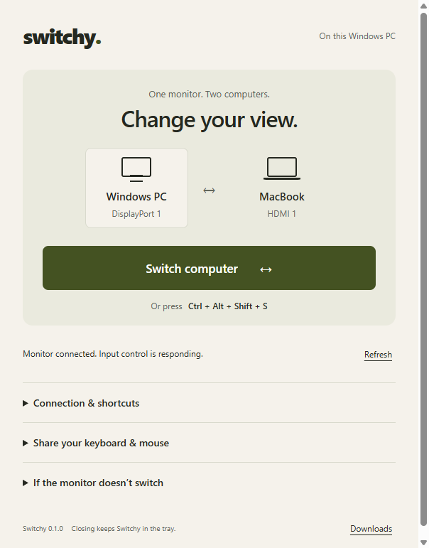

# Switchy

One monitor, a Windows PC on DisplayPort, and a MacBook on HDMI. Switch inputs with one button or a global shortcut.



## Download

[Windows installer and release files](https://github.com/givhvy/switchy/releases/latest)

- **Windows 10/11 x64:** download `Switchy-0.1.0-win-x64.exe`.
- **Apple silicon Mac:** source is ready, but the DMG has not been built yet. GitHub Actions is blocked by an account billing lock. Build on your Mac with the instructions below. Do not treat the GitHub source ZIP as an installable Mac app.

This initial Windows build has no publisher signature, so SmartScreen may appear. Only proceed for a download you trust. The Mac build uses ad-hoc signing, not Apple notarization; it may require Privacy & Security > Open Anyway after copying to Applications.

## Build the Mac download

On your M5 MacBook, open Terminal:

```bash
git clone https://github.com/givhvy/switchy.git
cd switchy
bash scripts/build-mac.sh
```

If Apple Command Line Tools are missing, run `xcode-select --install`, finish the installation, then rerun the script. The script downloads Node.js 22 into this project if needed, verifies its published checksum, builds the pinned monitor helper, runs tests, packages and ad-hoc signs the app, verifies its signature, and opens `dist` in Finder. It produces:

- `Switchy-0.1.0-mac-arm64.dmg`
- `Switchy-0.1.0-mac-arm64.zip`
- `SHA256SUMS-mac.txt`

Upload those files to [the release](https://github.com/givhvy/switchy/releases/tag/v0.1.0). If GitHub CLI is installed and signed in, run:

```bash
gh release upload v0.1.0 dist/Switchy-0.1.0-mac-arm64.dmg dist/Switchy-0.1.0-mac-arm64.zip dist/SHA256SUMS-mac.txt --repo givhvy/switchy --clobber
```

The script requires an Apple silicon Mac and internet access. A successful local Mac build and an M5 HDMI test are still pending.

## Set up

1. Enable **DDC/CI** in the monitor's physical menu.
2. Install Switchy on both computers.
3. Choose your shared monitor. Defaults: **DisplayPort 1 for Windows**, **HDMI 1 for Mac**. Change Mac to HDMI 2 if that is the connected port.
4. On Mac, check Monitor details and change the external display number or UUID if it is not `1`.
5. Click **Switch computer**, or press **Ctrl+Alt+Shift+S**. On Mac this is Control+Option+Shift+S. **Ctrl+Alt+Shift+W** requests Windows directly. Shortcuts are editable.

Closing the window keeps Switchy in the tray/menu bar. Quit from that menu. Startup at login is optional. Each computer keeps its own settings.

## Keyboard and mouse stay plugged into Windows

Switchy changes the monitor input. It does not capture or forward keyboard/mouse events. Install [Deskflow](https://github.com/deskflow/deskflow/releases/latest) separately on both computers for sharing:

- Windows is the **server**; the Mac is the **client**. Keep both awake on the same network.
- Connect the Mac to the Windows server address and verify its TLS fingerprint. Allow macOS Accessibility and Input Monitoring when requested.
- Put the Mac to the right of Windows in Deskflow's server layout. After changing the monitor input, move past the right edge to control Mac. Move left to return to Windows.
- **Monitor input and keyboard focus are separate actions in this version.** Switchy includes a setup guide; it does not install/configure Deskflow or provide automatic focus handoff.
- Windows must remain awake while the Mac uses its keyboard and mouse. The MacBook keyboard/trackpad and the monitor's physical button remain available if sharing fails.

## Hardware support

Windows uses the native DXVA2 API and VCP input code `0x60`. No monitor driver is installed. Physical monitor handles are released after every operation, and helper processes have timeouts.

The Mac build bundles [m1ddc](https://github.com/waydabber/m1ddc) at revision `04d949794102eb8df01ad3681afff6464a3eede2`, with its MIT license. It supports DDC over USB-C/DisplayPort and supported built-in HDMI ports. Actual behavior depends on the Mac, monitor, cable and adapter.

- A successful write means the command was sent, not that the other computer's picture was visually confirmed.
- Some monitors ignore DDC from an inactive port. Switch back from the displayed computer, or use the monitor button. A Windows shortcut cannot always reclaim the display from Mac.
- m1ddc does not expose input readback: the Mac toggle requests Windows. Windows reads the current input before toggling, falling back to its last successful request if input readback is unavailable.
- Direct connections are preferable; docks and adapters can block DDC.
- This release does not configure proprietary input codes or support Intel Macs.

## Development and verification

Requires Node.js 22+. `npm ci`, `npm test`, `npm start`. Build Windows with `npm run dist:win`; build Mac with `bash scripts/build-mac.sh`.

`node test/ui.cjs` exercises the actual Electron UI using a simulated monitor. `node test/hardware-smoke.cjs` performs a real Windows DDC read and a write that keeps the monitor on DisplayPort; only run it with that wiring.

The renderer has sandboxing, context isolation, no Node access, a restrictive CSP and a small IPC bridge. No network listener, analytics or credential storage is included. See [VALIDATION.md](VALIDATION.md) for completed checks and outstanding hardware tests.

GitHub Actions builds both platforms and publishes downloads for `v*` tags once the account billing lock is resolved.
